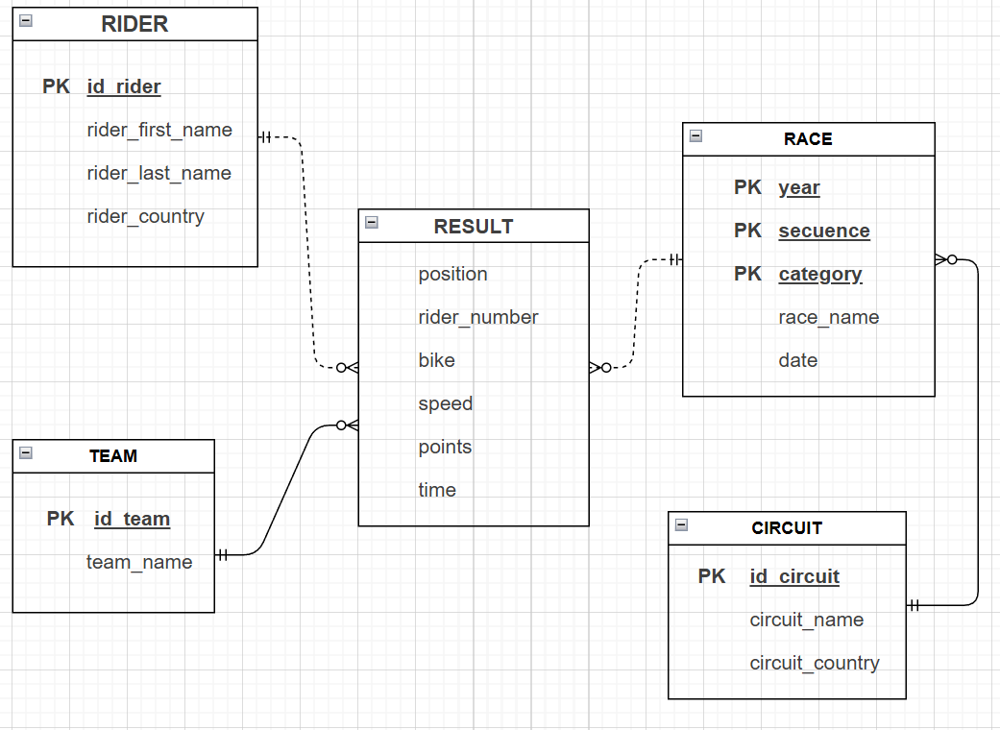
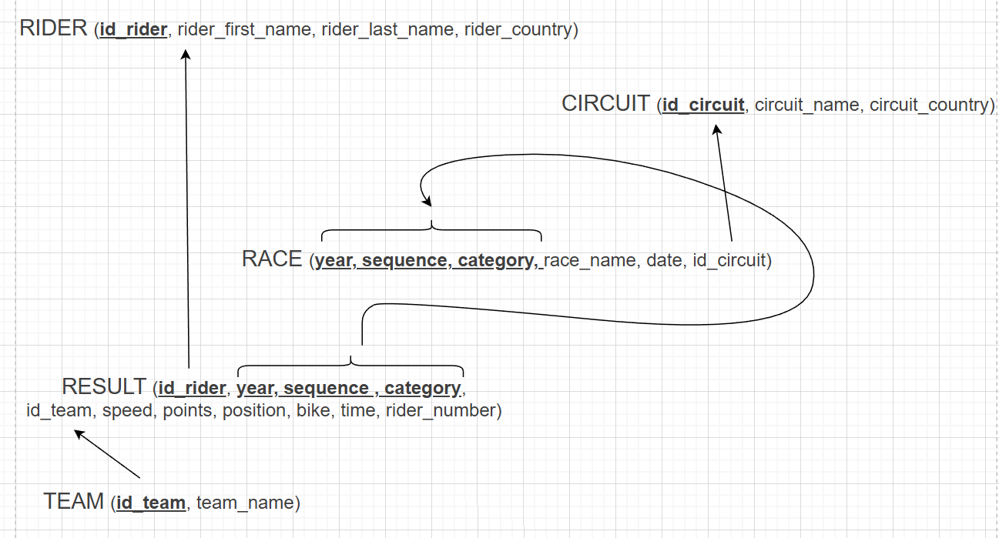

<!-- ================================================================
     PORTADA
     ================================================================ -->

<div align="center">

# 🏍️ MotoGP — Diseño y Migración de Base de Datos Relacional

<p>
  <!-- Sustituye 'TU_USUARIO' y 'TU_REPOSITORIO' por los valores reales de GitHub -->
  
  
  
  
  
</p>

<p>
  <strong>Bases de Datos I · Curso 2025/2026 · MATIC — ETSISI, UPM</strong><br/>
  Grupo Prac1_1 &nbsp;|&nbsp; Ni, Aibo &nbsp;·&nbsp; Ye, Sergio
</p>


</div>

---

## 📋 Tabla de contenidos

- [Descripción del proyecto](#-descripción-del-proyecto)
- [Dataset de partida](#-dataset-de-partida)
- [Estructura del repositorio](#-estructura-del-repositorio)
- [Instalación y requisitos](#-instalación-y-requisitos)
- [Pasos de reproducción](#-pasos-de-reproducción)
- [Modelo relacional](#-modelo-relacional)
- [Consultas analíticas](#-consultas-analíticas)
- [Resultados destacados](#-resultados-destacados)
- [Tecnologías utilizadas](#-tecnologías-utilizadas)

---

## 📖 Descripción del proyecto

Este proyecto transforma un dataset plano en formato CSV con el histórico de resultados del Campeonato del Mundo de Motociclismo (2000–2021) en una **base de datos relacional completamente normalizada** (hasta 3FN). El proceso cubre desde la auditoría inicial de los datos hasta la explotación mediante consultas analíticas avanzadas en MySQL.

```
CSV plano (17 columnas)  →  Auditoría EDA  →  Normalización 1FN/2FN/3FN
    →  SQLite (validación)  →  MySQL (producción)  →  6 Consultas SQL
```

---

## 📊 Dataset de partida

El fichero `moto_results.csv` contiene **29 931 registros** de carrera sin claves primarias ni foráneas.

| Característica | Valor |
|---|---|
| Filas totales | 29 931 |
| Columnas originales | 17 |
| Rango temporal | 2000 – 2021 |
| Categorías | MotoGP · Moto2 · Moto3 · 125cc · 250cc · 500cc · MotoE |
| Nulos en `rider_number` | 5 127 (17,13 %) |
| Nulos en `speed` | 992 (3,31 %) |
| Posiciones no positivas (DNF/DNS/DSQ/NC) | 5 475 (18,29 %) |
| Cambios de equipo intra-temporada | 329 casos |

---

## 📁 Estructura del repositorio

```
📦 practica-bd-motogp
 ┣ 📓 motogp.ipynb             # Notebook: EDA, dependencias funcionaleas, normalización y migración
 ┣ 📄 moto_results.csv         # Dataset original sin procesar
 ┣ 🗄️  motogp.db               # Base de datos SQLite (generada por el notebook)
 ┣ 📜 motogp.sql               # DDL: definición del esquema para MySQL
 ┣ 📜 motogp_mysql.sql         # DDL + DML completo para MySQL Workbench
 ┣ 📜 consultas_motogp.sql     # 6 consultas analíticas comentadas
 ┣ 📁 img/                     
 ┃   ┣ 🖼️  er_diagram.png      # Modelo conceptual con notación Martín
 ┃   ┗ 🖼️  logical_model.png   # Modelo lógico relacional
 ┗ 📄 README.md
```

> **Nota sobre `motogp.db`:** este fichero se genera automáticamente al ejecutar el notebook. Si no está presente en el repositorio (por tamaño), ejecútalo siguiendo los pasos de la sección siguiente.

---

## ⚙️ Instalación y requisitos

### Software necesario

| Herramienta | Versión mínima | Descarga |
|---|---|---|
| Python | 3.9+ | [python.org](https://www.python.org/downloads/) |
| MySQL Server + Workbench | 8.0+ | [mysql.com](https://dev.mysql.com/downloads/workbench/) |
| Jupyter Notebook | Cualquiera | `pip install notebook` |

### Dependencias Python

```bash
pip install pandas numpy matplotlib plotly sqlite3
```

---

## 🚀 Pasos de reproducción

### Paso 1 — Clonar el repositorio

```bash
git clone https://github.com/aiambo08/motogp_BDI.git
cd motogp_BDI
```

### Paso 2 — Ejecutar el notebook (EDA + migración a SQLite)

```bash
jupyter notebook motogp.ipynb
```

Al ejecutar todas las celdas, el notebook realiza automáticamente:

- ✅ Carga del CSV con `pandas`
- ✅ Normalización de nombres de circuito (`strip()` + `title()`)
- ✅ Corrección del país de MotorLand Aragón: `PT` → `ES`
- ✅ Sustitución del token `'?'` por `NULL` en equipos no identificados
- ✅ Generación de identificadores artificiales (`id_rider`, `id_team`, `id_circuit`)
- ✅ Creación de las 6 tablas normalizadas en `motogp.db` (SQLite)
- ✅ Verificación de integridad referencial (control de huérfanos)
- ✅ Generación del fichero `motogp_mysql.sql`

### Paso 3 — Inicializar el esquema en MySQL

Abre MySQL Workbench, conéctate a tu servidor local y ejecuta:

```sql
SOURCE /ruta/absoluta/al/proyecto/motogp.sql;
```

O bien: **File → Open SQL Script → `motogp.sql`** y pulsa ⚡ *Execute All*.

### Paso 4 — Cargar los datos en MySQL

```sql
SOURCE /ruta/absoluta/al/proyecto/motogp_mysql.sql;
```

> ⏱️ Tiempo estimado: **1 minuto** (el fichero contiene ~30 000 INSERTs en bloques de 500 filas).

### Paso 5 — Ejecutar las consultas analíticas

```sql
SOURCE /ruta/absoluta/al/proyecto/consultas_motogp.sql;
```

O abre el fichero en Workbench y ejecuta cada consulta individualmente con `Ctrl+Shift+Enter`.

---
### Diagrama conceptual


### Modelo lógico-relacional
 

### Decisiones de diseño clave

| Problema detectado en el EDA | Solución adoptada |
|---|---|
| `rider_number` no identifica unívocamente al piloto (14 colisiones) | Identificador artificial `id_rider` |
| `race_name`, `date`, `id_circuit` dependen solo de `(year, sequence)`, no de `category` → viola 2FN | Descomposición en `GRAND_PRIX` + `RACES` |
| Un equipo puede usar distintas motos en la misma temporada → `team` ↛ `bike` | `bike` se almacena en `RESULTS`, no en `TEAMS` |
| Códigos de país en formato ISO-2 en `circuits` vs. ISO-3 en `riders` | `UPDATE ... CASE` para unificar a ISO-3 |
| `race_name` no es identificador fiable (mismo nombre, distintos circuitos) | Se mantiene como atributo descriptivo, no como clave |

---

## 🗂️ Modelo relacional

El esquema original de tabla plana (17 columnas) se descompone en **6 tablas normalizadas**:

```
RIDERS     (id_rider PK, forename, surname, nationality)
    │
    └──► RESULTS ◄──── RACES ◄──── GRAND_PRIX (id_circuit FK)
              │             │                      │
          TEAMS          (year, seq,            CIRCUITS
         (id_team PK)     category)           (id_circuit PK)
```

### Esquema completo

```sql
RIDERS     (id_rider PK, forename, surname, nationality)
TEAMS      (id_team PK, name)
CIRCUITS   (id_circuit PK, name, country)
GRAND_PRIX (year PK, sequence PK, race_name, date, id_circuit FK)
RACES      (year PK, sequence PK, category PK)
RESULTS    (id_rider FK, year FK, sequence FK, category FK,
            id_team FK, bike, position, points, speed, time, rider_number)
```


---
## 🔍 Consultas analíticas

Todas las consultas están en `consultas_motogp.sql` con comentarios explicativos línea a línea.

| # | Pregunta analítica | Técnica SQL principal |
|---|---|---|
| 1 | Campeón del mundo MotoGP en el año más reciente | `HAVING SUM >= ALL (subquery)` |
| 2 | País con más pilotos distintos entre 2010 y 2019 (excl. MotoE) | `COUNT(DISTINCT)` + `HAVING = MAX` |
| 3 | Pilotos con al menos una victoria en MotoGP, Moto2 y Moto3 | `COUNT(DISTINCT category) = 3` |
| 4 | Campeones en Moto2 y Moto3 que nunca ganaron MotoGP | `IN` + `NOT IN` con subconsultas correlacionadas |
| 5 | Equipos ordenados por número de campeonatos en MotoGP | `SELECT DISTINCT (year, id_team)` + `COUNT(*)` |
| 6 | Circuitos donde nunca ha ganado un piloto local | `NOT IN` + comparación `nationality = country` |

---

## 🏆 Resultados destacados

| Consulta | Resultado |
|---|---|
| 🥇 Campeón MotoGP 2021 | **Fabio Quartararo** — 267 puntos |
| 🌍 País con más pilotos (2010–2019) | **Italia** — 80 pilotos distintos |
| 🏅 Pilotos tricampeones (MotoGP+Moto2+Moto3) | Oliveira, Martin, Bagnaia, Binder, Viñales, Rins |
| 🎯 Campeón Moto2+Moto3 sin MotoGP | **Álex Márquez** |
| 🏢 Equipo con más títulos MotoGP | **Repsol Honda Team** — 8 campeonatos |
| 🚫 Circuitos sin ganador local | **14 circuitos** (ARG, AUT, BRA, CHN, CZE, MAL, NED, POR, QAT, RSA, THA, TUR, USA×2) |

---

## 🛠️ Tecnologías utilizadas

<p>
  
  
  
  
  
  
  
</p>

---

<div align="center">
  <sub>Práctica 1 · Bases de Datos I · MATIC ETSISI-UPM · 2025/2026</sub>
</div>
